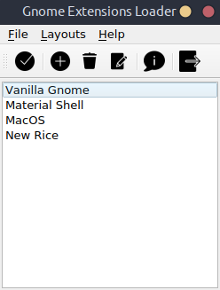

# Gnome Extensions Loader

GUI to save and load gnome shell extensions and extension settings. It makes it easier to share your gnome desktop look with others. 

If an extension does not exist on the system, it will be downloaded from extensions.gnome.org website automatically.

Config files and the downloaded extensions are stored in ~/.config/gnome-extensions-loader directory.



## Installation
To install the app run the following command in your terminal.
```
git clone https://github.com/emrecanaltinsoy/gnome-extensions-loader.git
cd gnome-extensions-loader
make install
```

To uninstall the app run the following command in your terminal.
```
make uninstall
```